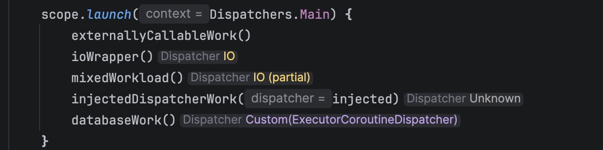

# Dispatcher Analyzer

See which dispatchers your Kotlin suspend functions use, directly in Android Studio.

[Download alpha](https://github.com/ch4rl3x/dispatcher-analyzer/releases) · [Demo project](samples/demo) · [Development](docs/development.md)

*From the demo project in an earlier alpha. Current badges use the `Dispatcher.` prefix.*

## Install

**Alpha · Android Studio Rabbit 1 (2026.2.1.8, platform 262)**

1. Download the plugin ZIP from [Releases](https://github.com/ch4rl3x/dispatcher-analyzer/releases). Do not extract it.
2. Open **Settings → Plugins → gear menu → Install Plugin from Disk…** and select the ZIP.
3. Restart if prompted, then let your project finish importing.

Analysis runs automatically after import and whenever Kotlin files are saved. Install a newer ZIP the same way to update. The plugin is not yet on JetBrains Marketplace.

## Read the badges

| Position | Meaning |
| --- | --- |
| Above a function | Incoming dispatchers from calls in your project. Uncalled functions have no badge. |
| After a call | Dispatchers used by the callee, including internal switches such as `withContext`. |

`(partial)` means only part of the analyzed work runs on that dispatcher. `Unknown` means the analysis cannot determine the context. Badges do not guarantee thread safety and never change your source.

Hover for an explanation. Click a colored dispatcher name to jump to its source evidence.

Customize dispatcher colors under **Settings → Editor → Color Scheme → Dispatcher Analyzer**. Colors are saved with the selected editor scheme and shared by badges and tooltips.

By default, call badges show only dispatcher-setting calls. Choose all calls, none, or limit them to the current function under **Settings → Tools → Dispatcher Analyzer**.

## Scope

Kotlin/JVM suspend functions, direct calls, standard coroutine builders, and proven dispatcher aliases. Flow, general higher-order analysis, DI inference, and multiplatform are outside this alpha; unresolved behavior stays `Unknown`.

[Analysis details](docs/analysis-model.md) · [Roadmap](ROADMAP.md) · [Contributing](AGENTS.md)
